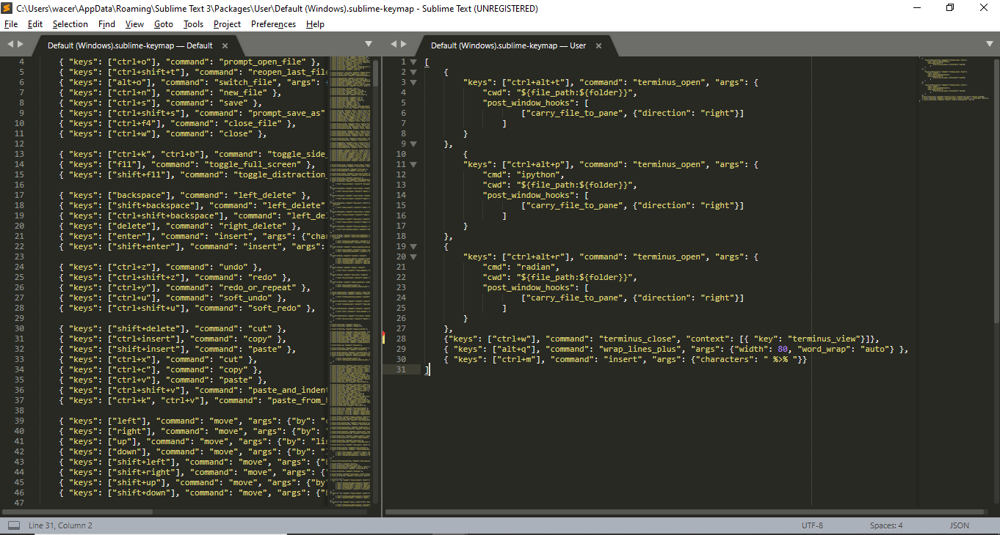

# Sublime Text - Configuracion

Este repositorio esta dedicado a la configuración del editor Sublime Text.

# ¿Por qué Sublime Text?
Actualmente existen múltiples editores de texto en los cuales se puede editar código. [VIM](https://www.vim.org/) es uno de lo editores por defecto en terminos de edición de código de muchos de los usauarios hoy en día. Una de sus mayores ventajas es la conexión que tiene con la terminal de Linux/Windows, ya que esto minimiza el uso del ratón del computador agilizando las tareas con el pasar del tiempo. Otros editores como [Atom](https://atom.io/) son una alternativa moderna a los editores clasicos, incorporando entornos de desarrollo integrado (IDE, por sus siglas en inglés) que facilitan la depuración de codigo en tiempo real. Mi primer editor de texto fue el bloc de notas que trae [R](https://cran.r-project.org/) incoporado (realmente muy básico y feo jajaja). Tiempo después llegó [Rstudio](https://rstudio.com/products/rstudio/download/) y *voilà* se convirtió en mi ambiente de desarrollo para programación estadística en R. Luego conocí VIM, en ese entonces podía realizar más de edición de texto que en Rstudio, a su vez se podía conectar a R con instalar ciertos *plugins*. Después apareció Sublime Text, en el cual su ambiente gráfico es un poco más amigable y entendible que el de VIM (VIM parece casi un bloc de notas con colores jajajaja). Finalmente probé Atom, muy similar a Sublime Text. 

Después de esta curva de aprendizaje, recomiendo Sublime Text, ya que no requerie una memorización de comandos tan extensa como lo puede llegar a ser en VIM. Es mucho más liviano que Rstudio (obviamente por que es un editor de texto y no un *IDE*) y particularmente la forma en la que realiza la depuración de código es mucho más limpia visualmente que Atom por ejemplo. Finalmente, la depuración del código se basa en la experiencia personal, el gusto y la comodidad que sienta cada uno en un editor particular. Invito a los lectores de este proyecto a provar muchos más editores enfocados a facilitar la programación estadística y exponer sus puntos de vista. La configuración que presento a continuación esta enfocada principalmente a la conectividad desde Sublime Text con R, Python y la terminal de Windows.


# Descarga e instalación

1. El instalador se encuentra disponible en la página del editor [Sublime Text](https://www.sublimetext.com/3). Asegurese de descargar la versión que corresponda a su plataforma Windows/Linux/OSX.
2. Ejecute el instalador siguiendo los pasos que el mismo le va indicando. 
3. Abra la paleta de comandos. En Windows: <kbd>ctrl+shif+p</kbd>  y en Linux: <kbd>cmd+shift+p</kbd>.
4. Escriba `Install Package Control` y presiones <kbd>enter</kbd>

Hasta aca, Sublime text está listo para realizar instalación de paquetes de personalización mediante el uso del paquete de control.

# Instalación de paquetes

La siguiente configuración esta orientada al desarrollo de código principalmente en R y Python. Si se instalan nuevos paquetes asegurese de que no tengan conflictos con los paquetes instalados en la siguiente configuración.

1. Instale el paquete [Terminus](https://github.com/randy3k/Terminus). Para ello realice lo siguiente:
    * Abra la paleta de comandos
    * Digite `Install Package` y presione <kbd>enter</kbd>. Espere a que se despligue nuevamente la paleta de comandos y escriba `Terminus` y presiones <kbd>enter</kbd> nuevamente.
    * Las opciones de personalización que se presentan en la pagina del paquete son supremamente útiles. En esta configuración se usan algunas de ellas en los siguiente pasos.

Este paquete permitira que se desplieguen dentro del mismo editor consolas de la terminal, iTerm, ConEmu, Cmder, Tmux, Terminus; R (RStudio), Julia y  IPython.

2. Instale el paquete [SendCode](https://github.com/randy3k/SendCode), realizando por la paleta de comandos como se realizó con el paquete Terminus.

Este paquete facilitara la conexión entre el editor y la terminal abierta.

# Personalización

Una vez instalados los paquetes `Terminus` y `SendCode`, vamos a personalizar nuestro ambiente para que se vuelva un IDE cuando lo necesitemos. Para ello dirijase a `Preferences -> Key Bindings` y en en la parte lateral derecha coloque la siguiente configuracion:

</img>


A continuación les dejo la configuración:


```javascript
[
    { 
        "keys": ["ctrl+alt+t"], "command": "terminus_open", "args": {
            "cwd": "${file_path:${folder}}",
            "post_window_hooks": [
                    ["carry_file_to_pane", {"direction": "right"}]
                ]
        }
    },
        { 
        "keys": ["ctrl+alt+p"], "command": "terminus_open", "args": {
            "cmd": "ipython",
            "cwd": "${file_path:${folder}}",
            "post_window_hooks": [
                    ["carry_file_to_pane", {"direction": "right"}]
                ]
        }
    },
    { 
        "keys": ["ctrl+alt+r"], "command": "terminus_open", "args": {
            "cmd": "radian",
            "cwd": "${file_path:${folder}}",
            "post_window_hooks": [
                    ["carry_file_to_pane", {"direction": "right"}]
                ]
        }
    },
    {"keys": ["ctrl+w"], "command": "terminus_close", "context": [{ "key": "terminus_view"}]},
    { "keys": ["alt+q"], "command": "wrap_lines_plus", "args": {"width": 80, "word_wrap": "auto"} },
    { "keys": ["ctrl+m"], "command": "insert", "args": {"characters": " %>% "}}
]
```


